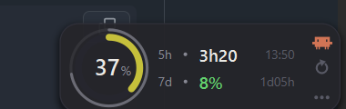
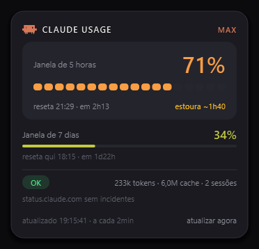

<div align="center">

# Claude Usage Widget

**Seus limites do Claude Code num widget flutuante na área de trabalho.**

[English](README.md) · **Português**

[](https://github.com/lucasmaziero/claude-usage-widget/actions/workflows/ci.yml)
[](https://github.com/lucasmaziero/claude-usage-widget/releases/latest)
[](https://www.python.org)
[](#instalação)
[](LICENSE)



<a href="https://lucasmaziero.github.io/claude-usage-widget/"><b>lucasmaziero.github.io/claude-usage-widget</b></a>

</div>

---

## Como funciona

A API da Anthropic não expõe endpoint de consulta de uso para contas de assinatura. A utilização
viaja de carona nos headers `anthropic-ratelimit-unified-*` de qualquer resposta, então o widget faz
um `POST /v1/messages` mínimo, com `max_tokens: 1`, só para lê-los:

| Header | Vira |
| --- | --- |
| `unified-5h-utilization` | porcentagem da janela de 5 horas |
| `unified-7d-utilization` | porcentagem da janela de 7 dias |
| `unified-5h-reset` / `unified-7d-reset` | relógio e contagem regressiva de cada reset |
| `unified-status` / `representative-claim` | chip de status e qual janela é o gargalo |

Duas consequências de o app rodar na **mesma máquina** que o Claude Code:

- **Nada para configurar.** O token OAuth sai de onde o próprio Claude Code o guardou, relido a cada
  ciclo: `~/.claude/.credentials.json` no Windows e no Linux, o chaveiro de login no macOS. Quando o
  Claude Code renova o token, o widget acompanha sozinho.
- **Contagem real de tokens.** Os headers só dizem porcentagem; os números absolutos existem apenas
  nos transcripts em `~/.claude/projects/**/*.jsonl`, que são lidos direto do disco.

## Instalação

Todos os downloads ficam na [página de releases][releases], cada um com seu SHA-256 ao lado. Os três
builds não são assinados, e cada sistema reclama do seu jeito; abaixo está como passar por isso.

Em qualquer um deles é preciso ter feito login do Claude Code na máquina (`claude` uma vez). Sem
isso, no lugar do número o widget mostra `faça login com claude uma vez`.

[releases]: https://github.com/lucasmaziero/claude-usage-widget/releases/latest

### Windows

`ClaudeUsage-<versão>.exe`, dois cliques. A instalação é **por usuário**, em
`%LOCALAPPDATA%\Programs\Claude Usage Widget`. Não pede admin nem passa por UAC. O assistente
oferece atalho na área de trabalho e iniciar junto com o Windows, ambos opcionais. Desinstala pelo
painel **Aplicativos instalados**, perguntando antes se deve apagar também suas preferências.

Sem assinatura, então o SmartScreen avisa "editor desconhecido" no primeiro download.

### macOS

`ClaudeUsage-<versão>-arm64.dmg` para Apple Silicon, `-x86_64` para Intel. Abra e arraste o app para
Applications. Ele não aparece no Dock, de propósito (`LSUIElement`): a barra de menus e o widget
flutuante são a interface inteira.

O bundle é assinado ad-hoc, não com um Developer ID, então o Gatekeeper recusa na primeira abertura.
Clique com o botão direito e escolha **Abrir**, que oferece a exceção que o duplo clique não dá, ou:

```bash
xattr -dr com.apple.quarantine "/Applications/Claude Usage Widget.app"
```

A primeira coleta abre um pedido de acesso ao chaveiro, porque no macOS o token mora lá e não num
arquivo. Escolha **Sempre permitir** e ele não pergunta de novo.

### Linux

`ClaudeUsage-<versão>.AppImage`, marcado como executável:

```bash
chmod +x ClaudeUsage-*.AppImage
./ClaudeUsage-*.AppImage
```

Duas ressalvas de desktop que vale saber antes de abrir um bug:

- **O GNOME não tem bandeja do sistema.** O ícone só aparece com uma extensão AppIndicator
  instalada. Sem ela o app percebe e mantém o widget flutuante na tela, já que o menu do botão
  direito dele tem os mesmos comandos.
- **O Wayland proíbe uma janela de se posicionar**, então a posição salva não pode ser restaurada.
  Onde houver um servidor X alcançável o app pede XWayland e a posição volta a funcionar; se você
  definir `QT_QPA_PLATFORM`, sua escolha sempre prevalece.

### Do código-fonte

Funciona nos três, e é o único caminho numa arquitetura sem build pronto.

```bash
uv sync
uv run claude-usage       # o ./run.sh desgruda do terminal
```

```powershell
uv sync
uv run claude-usage       # ou .\run.bat, que sobe sem janela de console
```

## Uso



**Widget.** Nenhum número aparece duas vezes: o anel responde *quanto já gastei da janela de 5h*, a
linha `5h` responde *quanto falta para ela resetar* (com o horário do reset à direita) e a linha `7d`
cobre a semana.

Em volta do anel corre um segundo anel, cinza sobre trilho, descontando até a próxima coleta, e ele
vira um giro verde enquanto a coleta acontece. O cinza é proposital: em uso alto o medidor fica
laranja ou vermelho, e um anel concêntrico da mesma família de cor se funde com ele.

A coluna da direita tem três andares: o mascote no topo, o botão de **atualizar agora** no meio e o
menu embaixo. Arraste o resto do cartão para posicionar (a posição fica salva), clique para abrir o
painel, ou use o botão direito em qualquer lugar para o menu.

**Painel.** A janela de 5h é o que morde primeiro, então fica num cartão com número grande e
medidor de 18 segmentos; a de 7 dias é apoio e vive solta sobre a superfície, com barra contínua.
Abaixo de um fio divisor vêm os metadados: chip de status (`OK` / `ATENÇÃO` / `BLOQUEADO`), tokens
reais da janela, incidentes abertos em `status.claude.com` e o carimbo da última coleta.

O mascote do cabeçalho acinzenta quando há erro de coleta ou incidente aberto, o mesmo sinal que o
selo do widget dá.

**Bandeja.** O ícone é o anel com o número dentro, desenhado num tamanho por vez para o shell não
precisar reduzir nada, inclusive nos tamanhos que a escala do monitor pede (25px a 125%). O tooltip
traz as duas janelas.

<br clear="right">

<div align="center"></div>

### Menu

| Item | O que faz |
| --- | --- |
| Atualizar agora | Força um ciclo fora do intervalo |
| Abrir painel | Mesmo que clicar no widget |
| Mostrar widget | Deixa só o ícone da bandeja |
| Modo compacto | Reduz o widget ao anel |
| Travar posição | Ignora o arrasto |
| Intervalo | 30 s a 15 min, padrão 2 min |
| Idioma | Automático, Português, English |
| Iniciar com o *&lt;seu sistema&gt;* | Leva o nome do sistema em que roda; um mecanismo para cada, ver abaixo |

Autostart e preferências são as únicas coisas que mudam de plataforma para plataforma:

| | Autostart | Preferências |
| --- | --- | --- |
| Windows | `HKCU\...\CurrentVersion\Run` | `%APPDATA%\ClaudeUsageWidget\settings.json` |
| macOS | `~/Library/LaunchAgents/com.lucasmaziero.claude-usage-widget.plist` | `~/Library/Application Support/ClaudeUsageWidget/settings.json` |
| Linux | `~/.config/autostart/claude-usage-widget.desktop` | `$XDG_CONFIG_HOME/claude-usage-widget/settings.json` |

Os três são por usuário: nenhum pede admin, e nenhum escreve fora da sua pasta pessoal.

### Idioma

A interface vem em português e inglês. Por padrão segue o idioma do sistema; o menu tem **Idioma**
com Automático, Português e English, e a escolha fica salva nas preferências. A troca vale na hora,
sem reiniciar.

Não é só rótulo: o dia da semana (`sex` / `Fri`), o separador decimal (`6,0M` / `6.0M`) e o plural
de sessões acompanham o idioma. Traduzir só os rótulos deixa o resultado meio convertido, que é pior
que não traduzir.

As strings ficam em `src/claude_usage/i18n.py`, um dicionário por idioma. Acrescentar um idioma é
copiar o dicionário do inglês, traduzir os valores e registrar em `LANGUAGES`; um teste garante que
as chaves e os campos de formatação `{assim}` batem entre todos os idiomas.

## Estrutura

```
src/claude_usage/   código do app       tests/       suíte de testes
installer/          empacotamento       tools/       geradores de ícone e preview
```

| Módulo | Papel |
| --- | --- |
| `paths.py` | Onde cada sistema guarda credenciais, transcripts e preferências |
| `credentials.py` | Lê o token OAuth do Claude Code, do arquivo ou do chaveiro do macOS |
| `autostart.py` | Iniciar com a sessão: chave Run, LaunchAgent ou entrada .desktop |
| `api.py` | Consulta de uso e incidentes; `parse()` separado para testar sem rede |
| `tokens.py` | Soma tokens da janela pelos transcripts locais |
| `poller.py` | Thread de coleta, histórico, burn rate e projeção |
| `theme.py` | Paleta, escala de espaçamento de 4pt e formatadores |
| `paint.py` | Primitivas de desenho: anel, medidor, chip, sombra, ícones |
| `brand.py` | Mascote do Claude Code a partir do SVG oficial, embutido como string |
| `i18n.py` | Strings da interface, um dicionário por idioma |
| `widget.py` | Barra flutuante |
| `panel.py` | Painel expandido |
| `app.py` | Bandeja, menu e montagem |

## Desenvolvimento

```powershell
uv sync                                           # cria o .venv com o grupo de dev
uv run pytest                                     # 114 testes, sem rede e sem janela
uv run ruff check .                               # lint (regras em pyproject.toml)
uv run python tools/preview.py docs/preview.png   # render offline das duas telas
$env:CLAUDE_USAGE_DEBUG=1; uv run claude-usage    # imprime cada ciclo no console
```

Os testes de render usam `QT_QPA_PLATFORM=offscreen` (ver `tests/conftest.py`) e verificam que todo
caminho de pintura roda sem estourar nos estados reais: sem dado, ao vivo, erro, coletando e modo
compacto.

Nesse modo o Qt troca o banco de fontes do sistema por um stub cuja fonte de fallback é ~1,8x mais
larga que a Segoe UI. Duas consequências:

- os testes que medem geometria de texto ficam condicionados à fonte (fixture `real_fonts`) e se
  pulam no modo headless. Para rodar a suíte inteira contra a fonte de verdade:

  ```powershell
  $env:QT_QPA_PLATFORM = "windows"; uv run pytest     # Windows
  ```

  ```bash
  QT_QPA_PLATFORM=cocoa uv run pytest                 # macOS
  QT_QPA_PLATFORM=xcb uv run pytest                   # Linux
  ```

- o `tools/preview.py` **não** usa offscreen de propósito: nesse modo todo glifo vira quadradinho.

Essa trava é mais rígida que "conseguimos uma fonte". As constantes de geometria do `widget.py` —
raio do anel, largura das colunas, os corpos que fazem `100%` caber dentro do medidor — saíram das
métricas de uma família só, e o `paint.MEASURED` registra qual. No macOS e no Linux o app resolve a
própria fonte de interface (`paint.CANDIDATES`) e esses testes se pulam, porque os números ainda não
foram medidos lá. Fazer essa medição, e acrescentar a família ao `MEASURED`, é a peça que falta do
port.

A camada de plataforma em si dá para testar de qualquer lugar: `paths`, `autostart` e o ramo do
chaveiro em `credentials` leem flags de módulo que os testes fixam, então o `test_paths.py` e o
`test_autostart.py` exercitam os caminhos de macOS e Linux rodando no Windows e vice-versa. Só o
backend de registro fica para uma máquina que tenha registro.

## Gerando os pacotes

Cada plataforma gera o próprio artefato, nela mesma. Não há compilação cruzada aqui: o PyInstaller
congela o interpretador e as bibliotecas Qt da máquina em que roda.

```powershell
.\installer\build.ps1                  # ícone -> PyInstaller -> Inno Setup
.\installer\build.ps1 -SkipInstaller   # só a pasta portátil em build\dist
.\installer\build.ps1 -Clean           # apaga build\ antes, inclusive os caches
```

```bash
./installer/build.sh                   # ícone -> PyInstaller -> .dmg ou .AppImage
./installer/build.sh --skip-package    # só a pasta portátil em build/dist
./installer/build.sh --clean           # apaga build/ antes, inclusive os caches
```

| Plataforma | Precisa de | Gera |
| --- | --- | --- |
| Windows | Inno Setup (`winget install JRSoftware.InnoSetup`) | `build/ClaudeUsage-<versão>.exe`, ~21 MB comprimidos para 70 MB instalados |
| macOS | Command line tools do Xcode, por causa de `iconutil`, `codesign` e `hdiutil` | `build/ClaudeUsage-<versão>-<arch>.dmg` |
| Linux | `appimagetool`, baixado na primeira execução | `build/ClaudeUsage-<versão>.AppImage` |

Cada execução deixa **um único** artefato em `build/`, o recém-gerado: guardar versões antigas lado
a lado é como se distribui o arquivo errado por engano.

| Arquivo | Papel |
| --- | --- |
| `installer/build.ps1` | Windows: os três passos, versão lida do `pyproject.toml` |
| `installer/build.sh` | macOS e Linux: os mesmos três passos, mais assinatura e empacotamento |
| `installer/claude-usage.spec` | PyInstaller, compartilhado: onedir, sem console, ícone e metadados por SO |
| `installer/claude-usage.iss` | Inno Setup: instalação por usuário, atalhos, autostart, desinstalador |
| `installer/entry.py` | Entry point do build congelado (o `__main__.py` usa import relativo) |
| `tools/gen_icon.py` | `.ico`, `.iconset` ou árvore hicolor, escolhidos pelo caminho de saída |

Decisões do empacotamento:

- **onedir, não onefile.** O `--onefile` descompacta todo o runtime do Qt numa pasta temporária a
  cada execução, um a dois segundos num app que mora na bandeja e sobe com a sessão.
- **`opengl32sw.dll` fora do pacote.** São 20 MB do OpenGL por software da Mesa, um quinto do
  bundle, e esta interface é pintada só pelo raster engine do Qt.
- **`QtDBus` fica de fora em todo lugar menos no Linux**, onde ele não é opcional: um ícone de
  bandeja num desktop Linux moderno *é* um StatusNotifierItem em D-Bus, e tirar o módulo deixa o app
  sem bandeja nenhuma.
- **O `.ico` é montado à mão, o `.icns` não.** Importar Pillow no mesmo processo do PySide6 carrega
  uma segunda libpng/zlib e o encoder PNG do Qt morre com violação de acesso, então o contêiner ICO
  é escrito direto — 40 linhas, e nenhum conflito de DLL. Para o macOS o gerador emite um diretório
  `.iconset` e deixa o `iconutil` da Apple montar o contêiner: um feito à mão que o macOS recusa
  caladinho seria a troca pior.
- **A assinatura ad-hoc no macOS não é cosmética.** Um binário arm64 sem assinatura é morto na
  abertura, então o `build.sh` sempre assina; o `CODESIGN_ID` troca por um Developer ID de verdade
  quando houver um.
- **A AppImage é gerada na imagem mais antiga do Ubuntu ainda suportada**, porque ela herda a glibc
  da máquina que a construiu e uma mais nova se recusaria a subir em distros mais velhas.

## Notas de implementação

Coisas que custaram tempo e que o código sozinho não explica:

- **`QGraphicsDropShadowEffect` em janela translúcida no Windows congela o conteúdo** depois do
  primeiro frame, e o widget desenhava `--` para sempre. A sombra é pintada à mão em `paint.shadow()`
  e cada janela reserva uma margem transparente para ela.
- **O receptor dos sinais do poller precisa ser `QObject`.** Ligado a um objeto Python comum, a
  conexão vira direta e o desenho acontece na thread da coleta.
- **Clicar no widget com o painel aberto chega em duas partes.** O `Qt.Popup` se fecha sozinho no
  clique de fora e o widget recebe o mesmo clique em seguida; sem guarda, o painel fechava e reabria
  no mesmo gesto. `Panel.just_closed()` engole o segundo evento por 250 ms.
- **Texto é medido, nunca posicionado por deslocamento fixo.** `56min` é meia vez mais largo que
  `2h13` e invadia a coluna do relógio. Os algarismos usam `tnum` (`QFont.setFeature`), senão o `1`
  é mais estreito que os outros dígitos e a contagem treme a cada segundo.

E quatro que só aparecem quando o app sai do Windows:

- **O macOS esconde janelas `Qt.Tool` sempre que o aplicativo perde o foco.** Num widget cuja função
  inteira é ficar visível enquanto você trabalha em outra coisa, isso significa nunca estar na tela.
  O `WA_MacAlwaysShowToolWindow` desfaz isso, e não faz nada nos outros dois.
- **O Wayland não dá a uma janela voz sobre a própria posição.** O `move()` é ignorado em silêncio,
  então a posição salva — que é boa parte da graça de um widget flutuante — não pode ser restaurada.
  Não há conserto dentro do protocolo; o `app.prefer_x11()` pede XWayland quando há um servidor X
  alcançável, e sai do caminho se o usuário definiu `QT_QPA_PLATFORM`.
- **O ícone de bandeja é desenhado sobre uma superfície que este app não pinta.** Dígitos quase
  brancos somem numa barra de tarefas, barra de menus ou painel claro, então a tinta segue o tema do
  sistema. No Windows isso quer dizer ler `SystemUsesLightTheme` do registro em vez do
  `colorScheme()` do Qt: o Qt reporta o tema *dos aplicativos*, e um arranjo de apps claros com
  barra escura sairia invertido.
- **No macOS o token não está num arquivo.** O Claude Code o guarda no chaveiro de login, então o
  `credentials.py` chama `security find-generic-password` e mantém o arquivo como plano B. Toda
  forma dessa chamada voltar vazia — sem login, acesso negado, binário inexistente — cai no arquivo
  e produz um erro só para os dois casos.

## Custo

Cada ciclo é um POST de 1 token de saída. A 2 minutos, são cerca de 700 requisições por dia, todas
do menor tamanho possível. Se incomodar, aumente o intervalo no menu.

## Licença

MIT. Veja [LICENSE](LICENSE).
